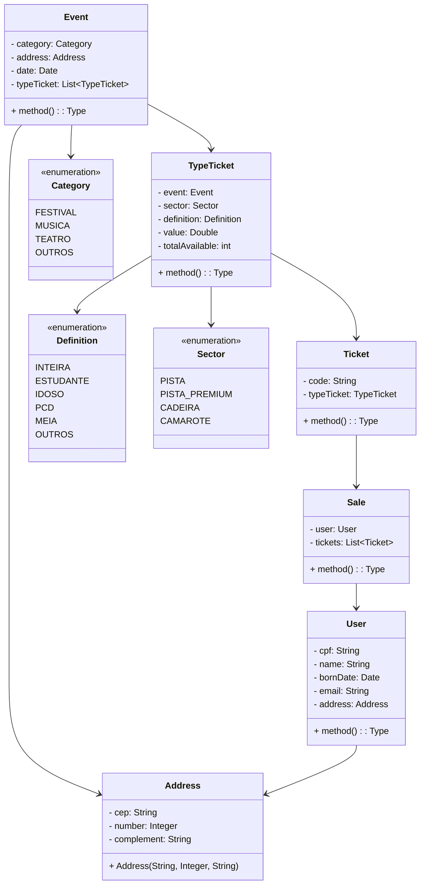

# Projeto: Site de venda de ingressos com Arquitetura Limpa

Este projeto implementa um sistema de cadastro de usuários utilizando os princípios da **Arquitetura Limpa** (Clean Architecture).
O objetivo é organizar o código de forma que seja independente de frameworks, fácil de manter e de escalar, promovendo a separação de responsabilidades entre as camadas.

## Diagrama de classes



### Descrição das Camadas do Projeto

#### 1. Application  
Essa camada concentra os casos de uso e interfaces que permitem que os dados transitem entre as camadas sem depender de implementações concretas.  
- **gateway**: Interface que define os contratos para operações de persistência relacionadas às entidades do domínio.  
- **usecase**: Casos de uso para as entidades. 

#### 2. Config  
Camada responsável pelos arquivos de configuração do projeto, como beans do Spring ou outras dependências.  
- **Config**: Arquivos gerais de configuração da aplicação.  

#### 3. Domain  
Camada onde estão as entidades do domínio e regras de negócio puras.  
- **domain**: Classes que representam as entidades principais do domínio.  

#### 4. Infra  
Camada responsável pelas interações externas, como frameworks e bibliotecas.  
- **controller**: Controladores REST para exposição de endpoints relacionados às entidades.  
- **gateway**: Mappers para conversão entre objetos de entidades e DTOs e implementações concretas do repositório usando JPA.  
- **persistence**: Interfaces que representam as operações no banco de dados e Classes que representam as entidades no banco de dados.  


## Configuração do Ambiente
1. Clone o repositório:
   ```bash
   git clone https://github.com/thallyta/clean-architecture-user.git
   ```

2. Acesse o diretório do projeto:
   ```bash
   cd clean-architecture-user
   ```

3. Compile o projeto:
   ```bash
   mvn clean install
   ```

4. Execute a aplicação:
   ```bash
   mvn spring-boot:run
   ```


## Testes
Os testes de unidade e integração estão localizados no diretório `src/test/java`. Para executar os testes:
```bash
mvn test
```

## Referências Futuras
Esta documentação serve como referência para o uso e manutenção do projeto. Considere as boas práticas adotadas aqui como base para futuros sistemas que utilizem a Arquitetura Limpa.


## Autor
- **Thallyta Castro**  
  [LinkedIn](https://www.linkedin.com/in/thallyta-castro)  
  [GitHub](https://github.com/thallyta)
